# 前処理パイプラインの定量的評価と実務ガイドライン

<div class="report-metadata">
  <p><strong>提出日:</strong> 2026年7月29日</p>
  <p><strong>作成者:</strong> 砂川 優治</p>
  <p><strong>所属:</strong> Nagoya International Professional University of Technology / IoT System Course</p>
  <p><strong>文書種別:</strong> NLP前処理パイプライン定量評価 最終報告書 (Task 9) </p>
</div>

## 第1章：総合概要 (Executive Summary) 
### 1.1 背景と目的

単一のベンチマークデータに対する単発の`train_test_split`評価では、前処理がモデルの挙動・精度に与える影響を厳密に検証できない。本プロジェクトでは、データの性質 (数値データの尺度・欠損・クラス不均衡・日本語テキスト) が異なる4つの実験 (A〜D) を設計し、以下4つの検証軸を全実験に共通して適用した。

1. **評価の信頼性向上**: 5分割`StratifiedKFold` (`shuffle=True, random_state=42`) による交差検証。分割は全モデル・全条件で共通のFold Indexを使い回す。
2. **モデルの説明性**: `coef_` (正/負/絶対値上位) ・`feature_importances_`の抽出。
3. **処理コストと精度のトレードオフ**: 学習・推論・前処理 (形態素解析等) の時間計測。
4. **ハイパーパラメータチューニング**: 主要パラメータ変化に対する過学習/未学習の挙動観察。

### 1.2 実験全体像

| 実験 | データ | Before | After | 適用モデル |
| :--- | :--- | :--- | :--- | :--- |
| A | Breast Cancer (569件、数値30特徴量)  | 未標準化 | `StandardScaler`標準化 | 4モデル共通 |
| B | 合成データ (800件、数値8＋カテゴリ2)  | 欠損行の削除 | 中央値/最頻値補完 (One-Hotは共通)  | 4モデル共通 |
| C | 合成不均衡データ (2000件、正例7.4%)  | 補正なし (C0)  | SMOTE (C1) ／`class_weight` (C2、3モデル限定)  | 4モデル共通＋発展 |
| D | livedoor News Corpus (7,361記事、9クラス)  | クレンジングなし＋IPA辞書 | `neologdn`＋Sudachi Mode C | 4モデル共通 |

### 1.3 主要な発見 (数値の要約) 

- **実験A**: 標準化によりk-NNは+0.028086ポイント (0.935010→0.963096) 、Logistic Regressionは+0.019329ポイント (0.954339→0.973669) 改善。Random Forestは平均差・Fold別差ともに**厳密に0.000000**であり、木モデルの尺度不変性が実測でも確認された。Logistic Regressionのfit時間は0.590857秒→0.009130秒 (約1/64.7) に短縮し、Before側で全5 Foldに発生していた`ConvergenceWarning`はAfterで解消した。
- **実験B**: 各特徴量15%のMCAR欠損を10列に独立注入した結果、行削除 (Before) は訓練データの平均80.625% (640件中平均124件) を失った。補完 (After) は全モデルでAccuracyが+0.043750〜+0.056250ポイント改善。
- **実験C**: 補正なし (C0) のLogistic Regressionは、Accuracy 94.8%と見かけ上高精度だが、Recallは39.2%にとどまり、実際の不正148件中90件 (60.8%) を見逃していた。SMOTE (C1) 適用後はRecallが全モデル・全Foldで改善 (例：logistic_regression +0.399ポイント) した。その一方で、Precisionは全モデル・全Foldで悪化した (同–0.520ポイント) 。Random ForestではSMOTE (C1、F1=0.762) よりも`class_weight='balanced'` (C2、F1=0.784、MCC 0.769 vs 0.743) の方がPrecision・F1・MCCで優れていた。
- **実験D**: `smax`カテゴリの記事861/870件 (98.9%) に自社媒体名「S-MAX」を含む本文末尾フッターが混入するメタデータリークを検出し、除去処理により1/870件まで低減した。除去後の本比較では、After (`neologdn`＋Sudachi Mode C) はBefore (クレンジングなし＋IPA辞書) に対し、4モデル全てでmacro-F1がわずかに低下した (平均差−0.0021〜−0.0046ポイント) 。語彙数はBefore 42,123語からAfter 46,936語へ**11.4%増加**し、前処理時間は約3.1倍 (6.02秒→18.79秒) に増加した。「表記揺れ吸収による精度向上・語彙圧縮」という仮説は本コーパスでは支持されなかった。

これらの結果は、前処理の効果が普遍的ではなく、**モデルの数学的性質** (距離・勾配ベースか、決定木ベースか) と**データの性質** (数値スケールの乱れ、欠損の有無、クラス比率、表記ブレ) への強い依存性を一貫して示す。

---

## 第2章：実験環境・共通評価プロトコル

### 2.1 評価基盤の設計方針

4実験を通じて再利用する共通モジュールを`src/`配下に実装した。

- **`src/utils.py`**: `get_outer_splits(X, y)`で`StratifiedKFold(n_splits=5, shuffle=True, random_state=42)`のFold Indexを1回だけ生成し、全モデル・全条件 (Before/After等) で使い回す。これにより、条件間の差が「Foldの偶然性」ではなく前処理そのものに起因することを担保する。`timer()` (`time.perf_counter()`ベースのコンテキストマネージャ) 、`ensure_output_dir()` (`outputs/exp_{id}`の自動生成) 、`save_environment_info()` (実行環境・主要ライブラリバージョンの記録) を提供する。
- **`src/models.py`**: 4モデル (`logistic_regression`, `linear_svc`, `random_forest`, `knn`) を共通ファクトリ関数`build_model()`から生成する。`SUPPORTS_CLASS_WEIGHT = {"logistic_regression", "linear_svc", "random_forest"}`により、k-NNには`class_weight`が存在しないという制約をコード上でも明示する。
- **`src/evaluation.py`**: `evaluate_pipeline_cv()`がFoldごとに未学習のPipelineを生成・`fit`・`predict`し、`fit_seconds`/`predict_seconds`を含むLong形式レコードを返す。`summarize_cv()`でCV平均・標準偏差を、`paired_fold_diff()`でFold単位のBefore→After差分 (平均差・差の標準偏差・改善/悪化Fold数) を算出する。
- **`src/explainability.py`**: `extract_linear_coefficients()`は正の係数上位・負の係数上位・絶対値上位を分けて抽出し、単一の絶対値ランキングだけに依存しない設計とした。`extract_tree_importances()`は`feature_importances_`上位を抽出する。

### 2.2 データリーク防止ルール

`StandardScaler`・`SimpleImputer`・`OneHotEncoder`・`TfidfVectorizer`・`SMOTE`等、学習データから統計量やパラメータを学習する処理は、すべてsklearnの`Pipeline`／`ColumnTransformer`、またはimblearnの`Pipeline`内に配置し、`evaluate_pipeline_cv()`のFoldループ内で学習用分割データのみに対して`fit`する構造を徹底した。検証用分割データは`predict` (および評価指標算出) にのみ用いる。

なお、実験Dで検出したメタデータリーク (媒体名フッターの混入) は、この統計的リーク防止構造では対処できない**データ内容そのものに起因するリーク**であり、別途ドメイン知識に基づくクレンジング (`src/experiments/preprocessing.py`の`_strip_footer`) で対処した (第6章) 。

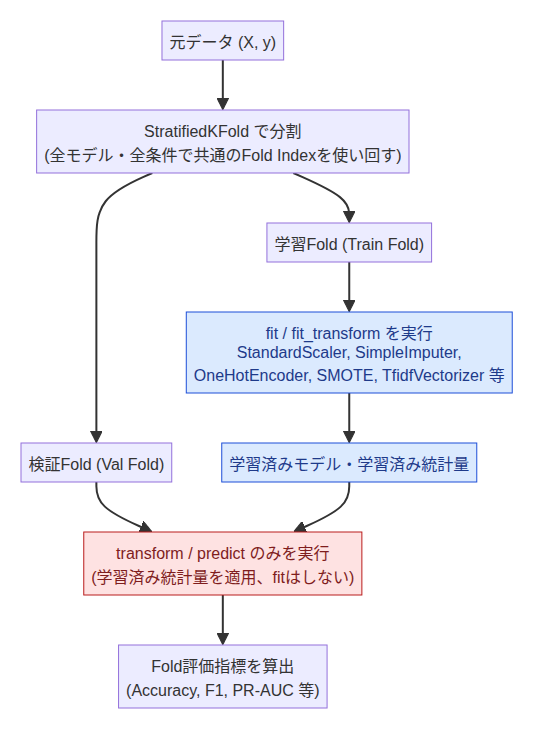
*図 2.1: StratifiedKFoldにおける厳格なデータリーク防止パイプライン構造*

### 2.3 コスト計測の実施範囲

各Foldの`fit_seconds`/`predict_seconds` (前処理＋モデル学習・推論を合算したEnd-to-Endの時間) を単回計測で記録した。実験Dのみ、形態素解析・クレンジングの時間をモデル学習とは別に一括計測した (`expD_preprocessing_time.csv`) 。前処理単独の`fit_transform`時間の分離、複数回計測による中央値・分位点の算出は今回のスコープでは実施していない (各章の留保事項を参照) 。

---

## 第3章：【実験A】数値特徴量における標準化 (StandardScaler) の定量的評価

参照ファイル: `expA_metrics_summary_agg.csv`, `expA_paired_fold_diff.csv`, `expA_coefficients.csv`, `expA_feature_importance.csv`, `expA_cv_score_bar.png`, `expA_feature_importance.png`, `expA_param_tuning.png`

### 【実験結果】

| モデル | Before Accuracy | After Accuracy | 平均差 | Fold改善/悪化 |
| :--- | ---: | ---: | ---: | :--- |
| Logistic Regression | 0.954339 ± 0.020889 | 0.973669 ± 0.018590 | +0.019329 | 4改善／0悪化／1同値 |
| Linear SVC | 0.950815 ± 0.018130 | 0.966636 ± 0.014371 | +0.015821 | 3改善／1悪化／1同値 |
| Random Forest | 0.956094 ± 0.013796 | 0.956094 ± 0.013796 | 0.000000 | 変化なし (全Fold同値)  |
| k-NN | 0.935010 ± 0.021925 | 0.963096 ± 0.019997 | +0.028086 | 5改善／0悪化 |

5-Fold CVによる標準化前後の精度比較を図 3.1に示す。

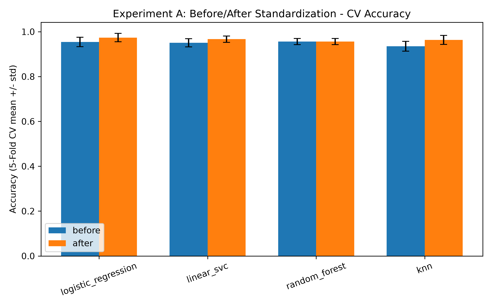
*図 3.1: 実験Aにおける未標準化 (Before) と標準化 (After) の5-Fold CV精度比較*

Logistic Regressionのfit時間はBefore 0.590857秒→After 0.009130秒 (約1/64.7) に短縮した。Beforeは全5 Foldで`max_iter=2000`に到達し`ConvergenceWarning`が発生したが、Afterは18〜21反復で収束し警告は解消した。Linear SVCも反復回数がBeforeの23〜30回からAfterの8〜10回へ減少した。

### 【考察】

k-NNはユークリッド距離に基づくため、未標準化データでは数値レンジの大きい特徴量が近傍関係を支配する。Logistic Regression・Linear SVCは正則化付き線形最適化モデルであり、特徴量スケールが損失関数の条件数 (曲率の異方性) に影響するため、未標準化データでは最適化が非効率になる。Random Forestは特徴量ごとの閾値分割に基づくため、単調な線形変換である標準化によって分割点・予測が変化せず、理論的な尺度不変性が実測 (差0.000000) でも裏付けられた。

### 【改善指針】

- k-NN・Logistic Regression・Linear SVCでは`StandardScaler`をPipelineの標準構成として組み込む。標準化はAccuracy改善だけでなく、収束安定性・学習コスト削減の観点からも必須要件と位置付ける。
- Random Forest単体運用では標準化の精度上の便益はない (本実験では0.000000) が、複数モデルを同一ワークフローで比較する場合は、モデル別Pipelineとして前処理の要否を明示する。
- ハイパーパラメータは、k-NNは`n_neighbors=3` (CV精度0.966589、Train−CVギャップ0.014079、`n_neighbors=1`のギャップ0.049200より縮小) 、Logistic Regressionは`C=0.1` (CV精度0.973669は`C=1`と同値だが、ギャップ0.008758は`C=1`の0.014468より小さい) を第一候補とする。この挙動を図 3.2に示す。最終決定はネストCVまたは独立テストデータで再検証する。
- 線形モデルの係数解釈は、収束済み・標準化後のモデルに限定する。未標準化係数の絶対値は特徴量スケールの影響を受けるため、重要度としての比較には用いない。

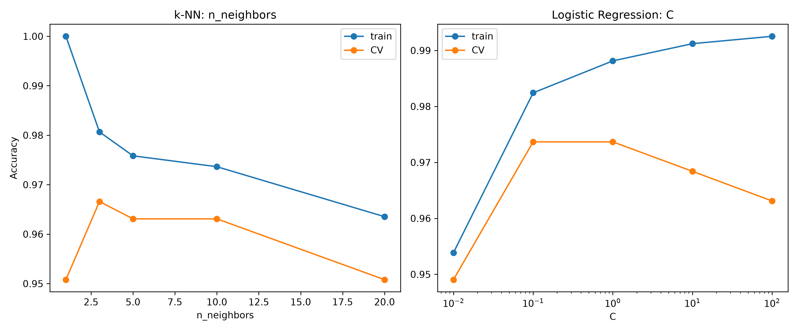
*図 3.2: 実験Aにおけるパラメータ変化に伴う Train/CV 精度推移 (Validation Curve)*

---

## 第4章：【実験B】欠損値処理における行削除 (Before) vs 補完 (After) の比較

参照ファイル: `expB_metrics_summary_agg.csv`, `expB_fold_sample_sizes.csv`, `expB_edge_cases.csv`, `expB_coefficients.csv`, `expB_feature_importance.csv`, `expB_cv_score_bar.png`, `expB_feature_importance.png`, `expB_param_tuning.png`

### 【実験結果】

本実験では、欠損値処理における行削除 (Before:完全行のみ保持) と補完 (After:中央値/最頻値補完) が各モデルの予測精度および学習データ量に与える影響を評価した。5-Fold CV による精度比較を表 4.1 および図 4.1 に示す。

| モデル | Before Accuracy | After Accuracy | 平均差 | Fold改善/悪化 |
| :--- | ---: | ---: | ---: | :--- |
| Logistic Regression | 0.751250 ± 0.032295 | 0.795000 ± 0.029778 | +0.043750 | 4改善／1悪化 |
| Linear SVC | 0.746250 ± 0.047926 | 0.796250 ± 0.034686 | +0.050000 | 5改善／0悪化 |
| Random Forest | 0.782500 ± 0.050852 | 0.835000 ± 0.038679 | +0.052500 | 5改善／0悪化 |
| k-NN | 0.747500 ± 0.047310 | 0.803750 ± 0.045629 | +0.056250 | 5改善／0悪化 |

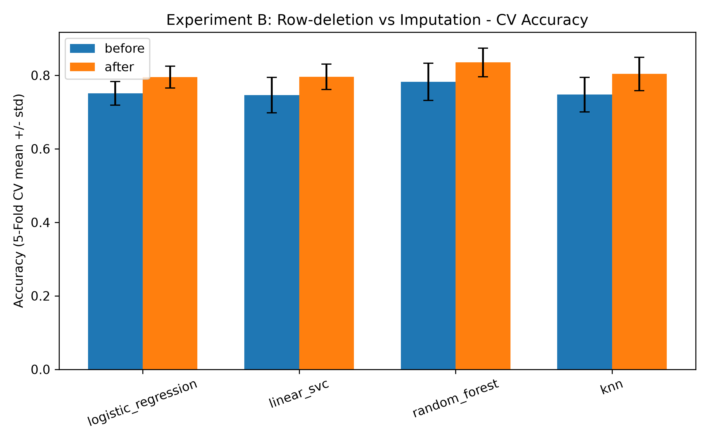
*図 4.1: 実験Bにおける行削除 (Before) と補完 (After) の5-Fold CV精度比較*

訓練データ640件に対し、Beforeの完全行保持は平均124.0件 (保持率19.4%) にとどまったが、Afterは全件保持した。また、全欠損列や低頻度カテゴリ統合などのエッジケースは発生しなかった (expB_edge_cases.csv) 。
fit時間はRandom Forestが+0.043秒 (0.132秒→0.175秒) と最大の増加を示した。

### 【考察】

各列15%の欠損率は、1列単位で見れば一見軽微 (全体の85%が生存) に見えるが、10列独立注入のため1行が完全である理論確率は`0.85^10 ≈ 0.1969`であり、実測保持率19.375%とほぼ一致する。行削除は、標本数減少を通じてパラメータ推定・決定境界の分散を増大させ、汎化性能を不安定にする。補完は情報を完全には復元しないが、全640件の目的変数と観測済み特徴量を学習に残せるため、本データでは「行削除による情報損失」の方が「補完の近似誤差」より大きかったと解釈できる。

### 【改善指針】

- 欠損を含む列が複数ある場合、列単位の欠損率だけでなく完全行の保持率を事前に算出する。本実験のように保持率が20%程度まで低下する場合、Listwise Deletionを既定処理として採用する根拠は乏しい。
- 数値列は中央値補完、カテゴリ列は最頻値補完、`OneHotEncoder(handle_unknown="ignore", min_frequency=2)`を`ColumnTransformer`にまとめ、モデルと同一Pipeline内で学習する。なお、補完統計量およびカテゴリ辞書はデータリークを防ぐため、各 CV Fold の訓練部分 (Train) のみから推定する。
- 本実験はMCAR (完全ランダム欠損) を前提としている。MAR/MNAR欠損では補完自体がバイアスを生む可能性があるため、欠損考察を検証し、必要に応じて欠損インジケータや高度な補完法と比較する。
- Random Forestの`max_depth`は`max_depth=5`を第一候補とする (CV精度0.777500、ギャップ0.101563。`max_depth=20`はCV精度0.785000と最良だがギャップ0.215000まで拡大しており、CV精度の差0.007500に対してギャップの増分が大きい。このTrain/CV精度の推移を図 4.2に示す) 。

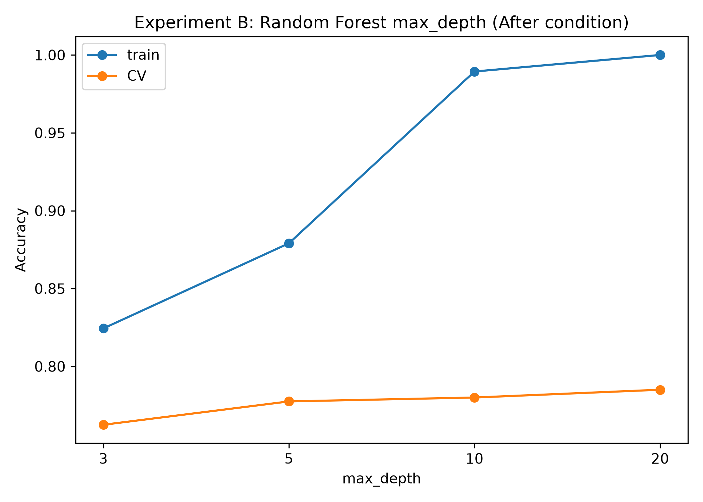
*図 4.2: 実験Bにおける Random Forest max_depth 変化に伴う Train/CV 精度およびギャップの推移*

---

## 第5章：【実験C】クラス不均衡データにおけるサンプリング・重み付け検証

参照ファイル: `expC_metrics_summary_agg.csv`, `expC_paired_fold_diff.csv`, `expC_fold_class_counts.csv`, `expC_coefficients.csv`, `expC_feature_importance.csv`, `expC_cm_logistic_regression.png`, `expC_precision_recall_tradeoff.png`, `expC_param_tuning.png`

### 【実験結果】

本実験では、重度のクラス不均衡データ (正例115件/負例1,430件、正例比率 約7.4%) における不均衡補正手法 (C0: 補正なし、C1: SMOTEオーバーサンプリング、C2: class_weight='balanced' 重み付け) が分類性能および学習時間に与える影響を比較評価した。主指標である Average Precision (PR-AUC) の 5-Fold CV 平均値を表 5.1 に示す。また、各手法のスコア分布を図 5.1 に示す。

| model | C0 (補正なし)  | C1 (SMOTE)  | C2 (class_weight)  |
| :--- | ---: | ---: | ---: |
| knn | 0.7167 | 0.6708 | 適用不可 |
| linear_svc | 0.6489 | 0.6329 | 0.6385 |
| logistic_regression | 0.6471 | 0.6263 | 0.6306 |
| random_forest | 0.8082 | 0.8265 | 0.8217 |

*表 5.1: 条件別の Average Precision (PR-AUC) CV平均*

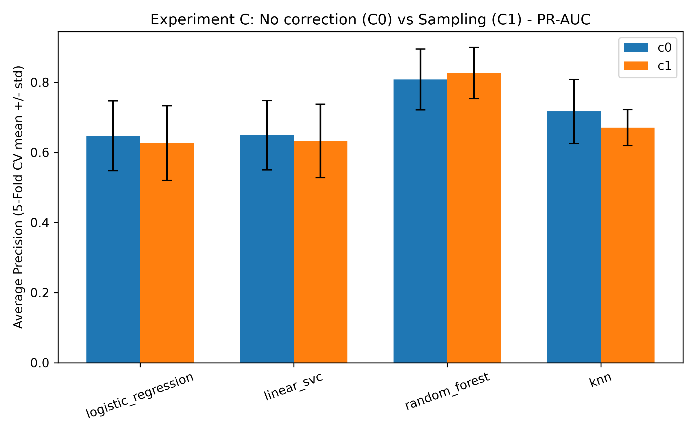
*図 5.1: 実験Cにおける条件 (C0/C1/C2) 別の Average Precision (PR-AUC) 比較*

C0のLogistic RegressionのOOF混同行列 (TN=1838, FP=14, FN=90, TP=58、実正例148件) から、Accuracy=(1838+58)/2000=**0.948**、Recall=58/148=**0.392**であり、同モデルは不正148件中90件を見逃していた (図 5.2) 。

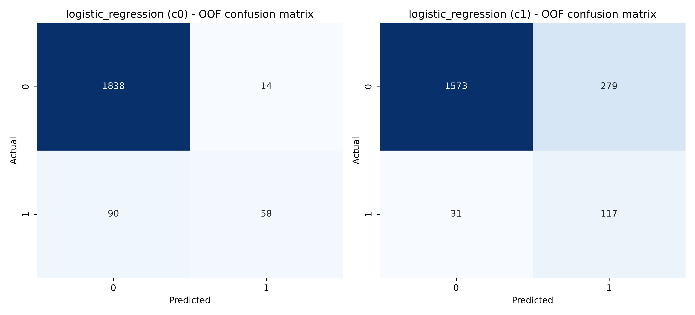
*図 5.2: 実験C (C0 補正なし) における Logistic Regression の OOF 混同行列*

C0→C1のFold単位ペア差 (expC_paired_fold_diff.csv) では、全モデル・全FoldでRecallが改善 (例：logistic_regression +0.399) した一方、Precisionは悪化 (同 -0.520) した。なお、Random ForestのみC1 (SMOTE) よりC2 (class_weight) の方がPrecision・F1・MCCで優れていた。このトレードオフを図 5.3に示す。

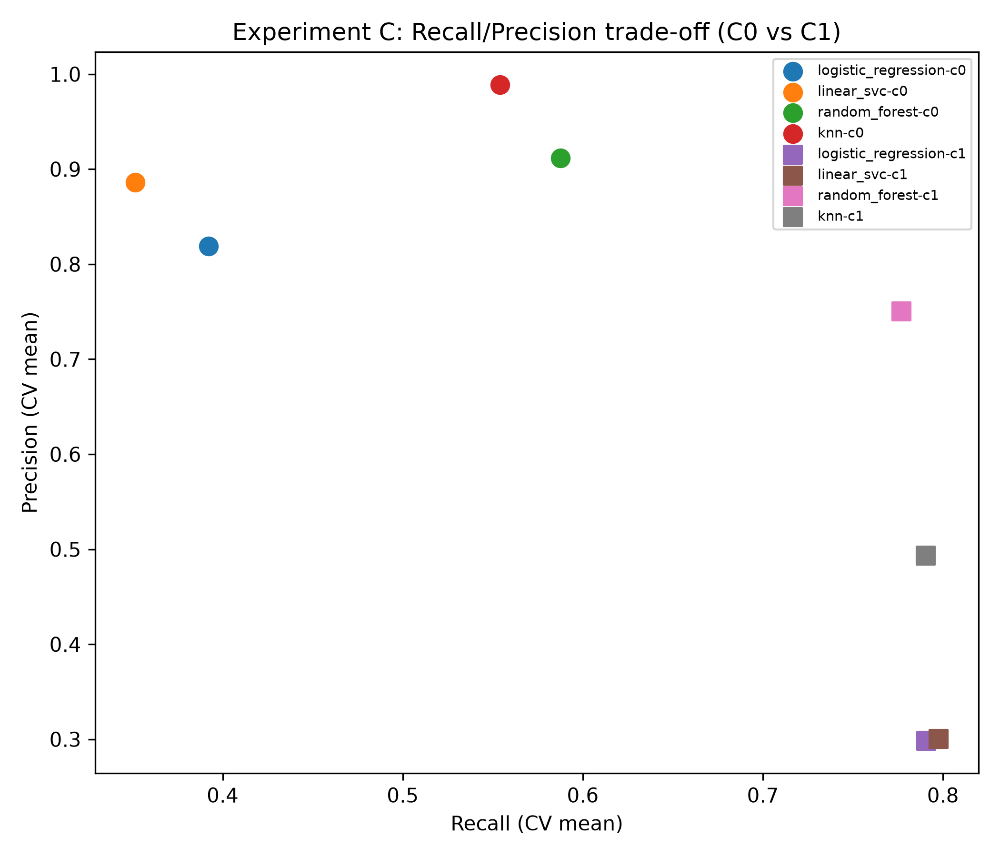
*図 5.3: 実験Cにおける条件 (C0/C1) ごとの Recall-Precision 分布トレードオフ*

Foldごとの正例比率 (`expC_fold_class_counts.csv`) は学習側7.38〜7.44%、検証側7.25〜7.50%の範囲に収まり、全体の正例比率7.4% (148/2000) から大きく偏らないことを確認した。

### 【考察】

正例が7.4%と少ない学習データでは、損失関数 (対数尤度・ヒンジ損失・ジニ不純度) は多数派クラスを正しく分類することへの寄与が支配的になり、決定境界が多数派側に引き寄せられる。これがC0でPrecisionが高くRecallが低く固着する要因である。SMOTEは少数クラスサンプル間の線形補間により少数クラス密度を人為的に高め、決定境界を少数派側へシフトさせるため、Recallが改善する一方でPrecisionは低下する。Random Forestで見られたC1/C2の差は、SMOTEが個々の決定木の分割点に部分的にしか波及しない一方、`class_weight`は分割基準 (不純度計算) そのものに直接作用するため、木モデルとの相性が異なることを示唆する。

サンプリング (SMOTE) はimblearnの`Pipeline`内、学習Fold限定で適用しており、検証Foldの情報がサンプリング過程に混入しない構造になっている。

### 【改善指針】

- 不均衡データではAccuracyを主指標から排除し、Average Precision (PR-AUC) を主指標、Recall・Precision・F1・Balanced Accuracy・MCC・混同行列を副指標として併記する。
- SMOTE等のサンプリングは必ず`imblearn.pipeline.Pipeline`内に置き、学習Fold限定で実行する。データ全体への事前適用はリークになるため行わない。
- C1 (SMOTE) とC2 (class_weight) の効果はモデルにより異なる (線形モデルではほぼ同水準、Random ForestではC2がPrecision・F1・MCCで優位) 。業務コスト構造 (見逃しコスト vs 誤検知コスト) に応じて、モデルごとに両手法を比較したうえで選択する。
- ハイパーパラメータ`C`の最適領域はC0とC1で異なる (C0はC=0.1付近、C1はC=0.01付近が最良) ため、補正手法を変更した場合は再チューニングする。

---

## 第6章：【実験D】日本語テキスト分類における前処理・形態素解析パイプライン比較

参照ファイル: `expD_metrics_summary_agg.csv`, `expD_paired_fold_diff.csv`, `expD_token_stats.csv`, `expD_vocab_size.csv`, `expD_metadata_leak_check.csv`, `expD_preprocessing_time.csv`, `expD_coefficients.csv`, `expD_feature_importance.csv`, `expD_param_tuning.png`

### 【実験結果】

本実験では、日本語テキスト分類における前処理パイプライン (Before: クレンジングなし＋IPA辞書 vs After: neologdn＋Sudachi Mode C) が分類精度、語彙数、処理コストに与える影響を評価した。

読込直後に検出された smax 記事の98.9% (861/870件) に及ぶフッター由来のメタデータリークは _strip_footer で1件に低減 (expD_metadata_leak_check.csv) させ、修正後コーパス (7,361記事) にて比較を実施した。5-Fold CV による macro-F1 の比較結果を表 6.1 および図 6.1 に示す。

| model | Before | After | 平均差 (After−Before)  | Fold改善/悪化 |
| :--- | ---: | ---: | ---: | :--- |
| knn | 0.7917 | 0.7891 | −0.00260 | 2改善／3悪化 |
| linear_svc | 0.9413 | 0.9393 | −0.00206 | 1改善／4悪化 |
| logistic_regression | 0.9118 | 0.9094 | −0.00244 | 1改善／4悪化 |
| random_forest | 0.8895 | 0.8850 | −0.00459 | 1改善／4悪化 |

*表 6.1: 前処理パイプライン変更前後における 5-Fold CV macro-F1 比較*

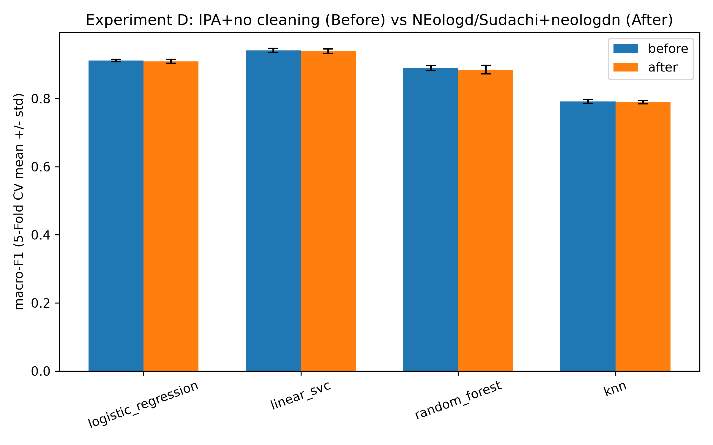
*図 6.1: 実験Dにおける Before (IPA辞書) と After (neologdn+Sudachi) の5-Fold CV macro-F1比較*

全モデルで平均差は負となり、精度改善は見られなかった。語彙数は42,123語→46,936語 (+11.4%) と増加して圧縮効果は得られず、前処理時間も6.02秒→18.79秒 (約3.1倍) に増大した (expD_preprocessing_time.csv) 。

説明性分析 (expD_coefficients.csv) では、it-life-hackで記号「■」の正方向係数 (+7.22) が突出した。同カテゴリ記事の96.4%に「■」が出現しており (他は5.4〜46.0%) 、書式上の特徴を強く捉えていた。

### 【考察】

livedoor News Corpusは校正済み記事のためneologdnによる補正対象が元々少ない。またSudachi Mode Cの辞書拡張がクレンジングの語彙圧縮効果を上回ったため語彙数が純増し、処理コスト増加に見合う精度上の便益は確認できなかった。

「■」の解釈について、it-life-hack媒体が本文を「■見出し」形式で構成する執筆習慣に起因する。TF-IDFは表層の出現頻度のみに基づくため、内容語と書式トークンを区別できず、この慣習を強い判別特徴として扱った。

Logistic RegressionのCはC=10付近でCVスコアが頭打ちとなり、高次元疎表現 (TF-IDF) 特有の「Train完全適合 (1.000) でもCVが大きく劣化しない」挙動を示した。一方、Random Forestのmax_depth (3〜20) はCVスコアが単調増加し続けた。この挙動を図 6.2に示す。

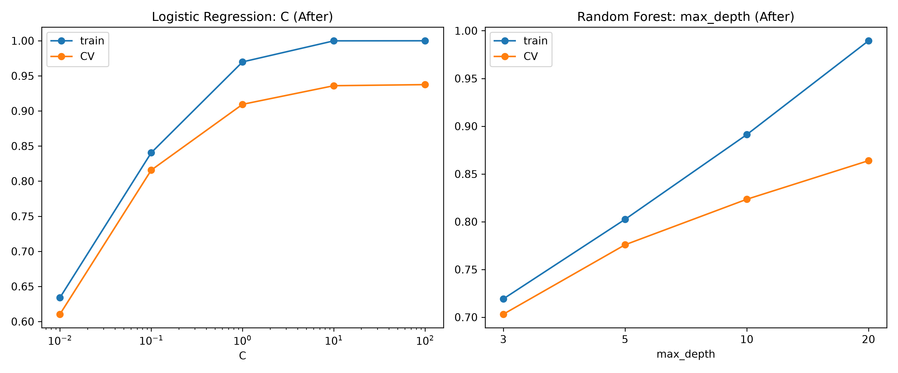
*図 6.2: 実験Dにおける C (Logistic Regression) および max_depth (Random Forest) の推移*

### 【改善指針】

- 媒体・収集元由来のフッター (関連リンク・関連記事・署名) は前処理の最初期段階で除去し、除去後は「本文中に自クラス名が含まれる記事の割合」を機械的に再検査する。
- 説明性分析の上位語に記号・書式トークンが含まれる場合、それが内容語かフォーマット由来かを個別に確認する。
- 「高度な前処理を追加すれば精度が向上する」という前提を置かず、Before/AfterのCVアブレーションで実測する。本実験ではneologdn＋Sudachi Mode C導入によりmacro-F1が4モデル全てでわずかに低下し、語彙数は逆に増加した。
- 校正済みコーパスでは軽量前処理 (IPA辞書、クレンジングなし) をベースラインとし、拡張辞書・クレンジングの追加は処理コスト増 (本実験では約3.1倍) に見合う精度改善が実測で確認された場合にのみ採用する。

---

## 第7章：横断的考察 (4実験から導出された機械学習前処理の設計原則) 

### 原則1：前処理の効果はモデルの数学的性質に依存する

距離計算 (k-NN) ・勾配ベースの正則化付き最適化 (Logistic Regression, Linear SVC) に基づくモデルは、特徴量スケール (実験A) やサンプリングによる決定境界シフト (実験C) の影響を強く受ける。一方、決定木アンサンブル (Random Forest) は、単調変換である標準化に対して理論的に不変であり、実験Aでは差が厳密に0.000000だった。同じRandom Forestでも、SMOTE (決定境界を確率的にシフトさせる) に対しては他モデルほど極端ではないが影響を受け (実験C、Precision低下幅–0.162は他モデルの約1/3) 、`class_weight` (分割基準に直接作用) とは異なる反応を示した。**「前処理を導入すればどのモデルにも同じ効果がある」という前提は成立しない。**

### 原則2：評価指標の選択はデータ特性に応じて変える必要がある

実験Cでは、不均衡データにおいてAccuracy (94.8%) とRecall (39.2%) が大きく乖離する「数値の罠」が定量的に確認された。実験Dでは、逆に「前処理を高度化すれば評価指標が向上する」という直感が、校正済みテキストという前提条件のもとでは支持されなかった (macro-F1が全モデルで微減) 。両者に共通するのは、**単一の集計指標や単一の仮説だけで前処理・モデルの良否を判断してはならない**という点であり、複数指標・Fold単位のペア差・データ特性の事前確認が必要である。

### 原則3：データリーク防止は統計的リークとデータ内容リークの両面で必要

実験B・Cでは、学習型前処理 (Imputer, Encoder, SMOTE) を`Pipeline`／`ColumnTransformer`内でFold限定fitする**統計的リーク防止**を徹底した。実験Dでは、これとは異なる種類のリーク、すなわち**データ内容そのものに起因するリーク** (媒体名フッターの混入) を検出した。これはPipeline構造だけでは防げず、ドメイン知識に基づくコンテンツ検査 (クラス名の literal 出現率チェック等) が別途必要であることを示している。両方のリーク対策を独立した検証項目として運用することを提言する。

### 原則4：処理コストと精度改善は自動的には両立しない

実験Aでは、標準化がAccuracy改善と同時に学習コストを約1/64.7に削減するという、精度・コストの両面で正の効果を示した。対照的に実験Dでは、前処理コストが約3.1倍に増加したにもかかわらず精度改善が確認されなかった。実験Bでは、補完によりRandom Forestのfit時間が+0.042911秒増加したが、標本保持による精度改善 (+5.25ポイント) がそれを上回ると判断された。**処理コストの増減と精度への影響は独立に評価し、コスト増を伴う前処理の採否は実測された精度差と対比して判断する**必要がある。

---

## 第8章：総合結論 — 今回の実験成果に基づく実務適用ガイドライン

本章は単なる抽象的な提言集ではなく、実験A〜Dで実測した数値によって裏付けられた「現場でそのまま使える判断ルール」として結論を再構成する。前処理の意思決定を、(1) 理論的に結果が予見でき検証を省略してよい領域と、(2) データのドメイン固有の性質に依存し実測比較 (アブレーション) が必須な領域とに切り分けることが、本検証全体から導かれる中心的な実務的含意である。この意思決定フローを図 8.1に示す。

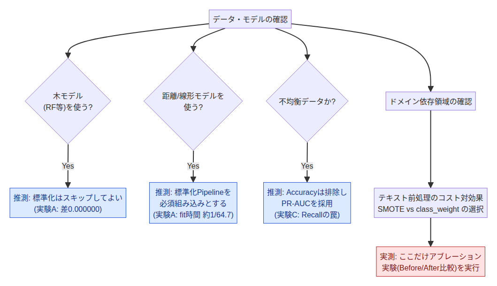
*図 8.1: 実務における前処理・モデル選定の意思決定フロー*

### 8.1 事前推測 (ショートカット) が有効なルール

実験A・Cで確認されたモデル構造に起因する挙動は再現性が高く、実データでも同様の結果が予見できるため、都度の比較実験を省略し、標準パイプラインとして既定化してよい。

1. **木モデルの尺度不変性 (標準化の検証省略) **: Random Forestは、標準化の有無によってAccuracy・Fold別スコアが**完全に一致**した (実験A、平均差0.000000、全5Fold同値) 。したがって、決定木系アルゴリズム (Random Forest、GBDT等) を単体運用する場合、標準化のBefore/After比較実験は省略し、開発速度を優先してよい。
2. **距離・勾配ベースモデルでの標準化の必須性**: k-NN・Logistic Regression・Linear SVCでは、標準化によりAccuracyが+0.015821〜+0.028086ポイント改善し、Logistic Regressionのfit時間は0.590857秒→0.009130秒 (約1/64.7) に短縮、全5Foldで発生していた`ConvergenceWarning`も解消した (実験A) 。この便益は距離計算と最適化の条件数から予見可能なので、`StandardScaler`はPipelineへ検証なしで組み込む標準構成とする。
3. **不均衡データにおけるAccuracyの排除**: 正例7.4%の不均衡データにおいて、Accuracy 94.8% (C0, Logistic Regression) に対しRecallが39.2% (不正148件中90件を見逃し) にとどまるという乖離が構造的に確認された (実験C) 。この「見かけの高精度」は不均衡データの数学的帰結として事前に予見できるため、不均衡データを扱う時点でAccuracyを主指標候補から外し、最初からPR-AUC・Recall・Precisionを主指標に据える。

### 8.2 実測比較 (アブレーション) が必須の領域

一方、データのドメイン固有の性質 (表記の乱れの量、クラス間の分布形状) に依存する効果は、理論だけでは方向性を予見できず、実測を省略すると判断を誤るリスクが高い。この領域に検証工数を重点配分する。

1. **前処理の高度化と処理コストの対効果 (テキスト処理) **: 「クレンジング・拡張辞書を導入すれば精度が上がる」という仮説は、校正済みのニュースコーパスでは支持されず、語彙数が+11.4%増加 (42,123語→46,936語) 、処理時間が約3.1倍 (6.02秒→18.79秒) に増加した一方、4モデル全てでmacro-F1はわずかに低下した (実験D) 。この結果はコーパスの表記の乱れの少なさに依存するため、対象データごとにBefore/Afterを実測し、コスト増に見合う精度改善が確認された場合にのみ高度な前処理を採用する。
2. **不均衡補正手法 (SMOTE vs class_weight) の選択**: 線形モデル (Logistic Regression, Linear SVC) ではSMOTE (C1) とclass_weight (C2) のRecall・Precisionはほぼ同水準だったが、Random ForestではC1がRecall・PR-AUCで優位、C2がPrecision・F1 (0.784 vs 0.762) ・MCC (0.769 vs 0.743) で優位という、モデルに依存した逆転が生じた (実験C) 。したがって、どちらか一方を既定路線とせず、採用予定のモデルごとにC1/C2を比較したうえで、業務上の見逃しコストと誤検知調査コストの比率に応じて選定する。
3. **欠損処理方針 (行削除 vs 補完) の閾値判断**: 行削除は列数と欠損率の組み合わせ次第で保持率が急減しうる (実験Bでは10列×15%の独立欠損により保持率19.375%まで低下) 。保持率がどの水準まで低下するかはデータ依存であるため、必ず事前に完全行の保持率を算出したうえで、行削除と補完のAccuracy差を実測して既定処理を決定する。

### 8.3 統計的リークとデータ内容リークの二重チェック

Pipeline構造による統計的リーク防止 (学習型前処理をFold内でfitする設計、実験B・Cで徹底) は統計量の混入を防ぐが、**データ内容そのものに起因するリークは防げない**。実験Dでは、`smax`における自社媒体名フッターの混入 (98.9%) や、it-life-hackにおける執筆慣習由来の記号「■」 (96.4%出現、正方向係数1位+7.22) という、書式上の疑似リークを確認した。

Pipeline化を「リーク対策完了」と過信せず、以下を実務プロセスの必須ステップとする。

- 本文中におけるクラス名・媒体名の出現率を機械的に検査。
- `coef_` や `feature_importances_` の上位特徴量を点検し、非内容語 (記号・定型文) の混入がないか確認。
- 除去処理後も同検査を再実行 (本実験でも1回目のフッター除去後、別形式の「■」使用が発覚したため) 。

### 8.4 総括

本プロジェクトで確立した検証枠組みの実務的な価値は、「あらゆる前処理をゼロから検証する」ことではなく、**理論的に結果が予見できる領域 (8.1) はショートカットして標準パイプライン化し、データ依存性が高く結果がブレやすい領域 (8.2) にアブレーション検証を集中させ、加えてPipeline構造では防げないデータ内容リーク (8.3) を独立して点検する**という、効率的かつ再現性の高い前処理設計プロセスを実現する点にある。

以上の知見は、本プロジェクトで用いた合成データおよびlivedoor News Corpusに基づく実測値である。実運用データでは正例比率・欠損パターン・表記の乱れの程度・媒体固有の書式慣習が異なりうるため、8.1の「ショートカット可能」という判断はモデルの数学的性質に由来する範囲 (標準化・Accuracy排除等) に限定し、8.2の「実測必須」の判断とは明確に区別して運用する。

---

## 付録A：実務用リーク防止パイプライン・テンプレート (Python)

以下は、本レポートの各実験で確立したリーク防止構造 (第2.2章、図2.1) をそのまま業務コードへ転用できる形にした最小限のテンプレートである。列名・パラメータはダミー値であり、機密情報は含まない。

#### A.1 数値・カテゴリ混合データ用 (StandardScaler + Imputer + OneHotEncoder) 

```python
from sklearn.compose import ColumnTransformer
from sklearn.impute import SimpleImputer
from sklearn.linear_model import LogisticRegression
from sklearn.model_selection import StratifiedKFold, cross_validate
from sklearn.pipeline import Pipeline
from sklearn.preprocessing import OneHotEncoder, StandardScaler

numeric_features = ["age", "income", "tenure_months"]
categorical_features = ["region", "plan_type"]

numeric_pipeline = Pipeline([
    ("imputer", SimpleImputer(strategy="median")),
    ("scaler", StandardScaler()),
])
categorical_pipeline = Pipeline([
    ("imputer", SimpleImputer(strategy="most_frequent")),
    ("onehot", OneHotEncoder(handle_unknown="ignore", min_frequency=2)),
])

preprocessor = ColumnTransformer([
    ("num", numeric_pipeline, numeric_features),
    ("cat", categorical_pipeline, categorical_features),
])

pipeline = Pipeline([
    ("preprocessor", preprocessor),
    ("model", LogisticRegression(max_iter=2000)),
])

# 外側CVの分割は全モデル・全条件で共通のFold Indexを使い回す (第2.1章) 
cv = StratifiedKFold(n_splits=5, shuffle=True, random_state=42)
# fit/fit_transformは学習Foldのみに適用され、検証Foldにはtransform/predictのみが適用される
scores = cross_validate(pipeline, X, y, cv=cv, scoring=["accuracy", "f1_macro"])
```

#### A.2 不均衡データ用 (imblearn Pipeline + SMOTE / class_weight) 

```python
from imblearn.over_sampling import SMOTE
from imblearn.pipeline import Pipeline as ImbPipeline
from sklearn.ensemble import RandomForestClassifier
from sklearn.linear_model import LogisticRegression
from sklearn.model_selection import StratifiedKFold, cross_validate
from sklearn.preprocessing import StandardScaler

# C1: SMOTEによる学習Fold限定サンプリング (scaler → sampler → model の順序を厳守) 
smote_pipeline = ImbPipeline([
    ("scaler", StandardScaler()),
    ("sampler", SMOTE(random_state=42)),
    ("model", LogisticRegression(max_iter=2000)),
])

# C2: class_weightによる重み付け (k-NNにはclass_weightパラメータが存在しないため適用不可) 
weighted_pipeline = ImbPipeline([
    ("scaler", StandardScaler()),
    ("model", RandomForestClassifier(class_weight="balanced", random_state=42)),
])

cv = StratifiedKFold(n_splits=5, shuffle=True, random_state=42)
for name, pipe in [("SMOTE", smote_pipeline), ("class_weight", weighted_pipeline)]:
    scores = cross_validate(pipe, X, y, cv=cv, scoring=["average_precision", "recall", "precision"])
    print(name, {k: v.mean() for k, v in scores.items() if k.startswith("test_")})
```

いずれの構成も、サンプリング・補完・エンコーディングを`Pipeline`外で事前に`fit`しないこと、および`cross_validate`／自作のFoldループのいずれを使う場合も同一の`cv`オブジェクト (またはそこから生成したFold Index) を全条件で使い回すことが、第2章・第8章で述べたリーク防止・比較可能性の担保に直結する。

---

## 付録B：ディレクトリ構成

```
task9/
├── README.md
├── docs/execution_plan.md
├── assets/styles/report.css
├── scripts/
│   ├── core/ (run_exp_a.py〜run_exp_d.py)
│   ├── extra/ (発展実験・集計・図生成)
│   └── report/ (PDF構築・検査・ページ画像生成)
├── src/
│   ├── experiments/ (evaluation.py, explainability.py, models.py, preprocessing.py)
│   ├── reporting/ (layout_checker.py, layout_pipeline.py, pdf_renderer.py, report_builder.py)
│   └── utils.py
├── tests/
│   ├── conftest.py, test_common_modules.py
├── data_cache/
│   └── text/ (livedoor News Corpus展開先) 
└── outputs/
    ├── SUMMARY_REPORT.md, SUMMARY_REPORT_extra.md
    ├── discussion_draft/
    │   ├── exp_a.md, exp_b.md, exp_c.md, exp_d.md
    ├── exp_a/ (expA_*.csv, *.png, environment.json) 
    ├── exp_b/ (expB_*.csv, *.png, environment.json) 
    ├── exp_c/ (expC_*.csv, *.png, environment.json) 
    └── exp_d/ (expD_*.csv, *.png, environment.json) 
```

---

## 付録C：発展実験

### 実験A (発展) ：Permutation Importance

#### 方法

- Breast Cancerデータ (569件、30特徴量) を使用した。
- 全条件・モデルで本文同様の StratifiedKFold(n_splits=5, shuffle=True, random_state=42) 分割を共用した。
- 各モデルを学習Foldのみでfitし、未使用の検証Fold上でAccuracyを評価した。
- 各特徴量を検証Fold内で30回並べ替え、Accuracy低下量をPermutation Importanceとした。
- StandardScalerはAfter条件のみPipeline内でfitした。並べ替えはPipelineへの入力列に対して行った。

#### 結果

| モデル | Before上位特徴量 (平均PI)  | After上位特徴量 (平均PI)  | 最大のBefore→After差 |
|:--|:--|:--|:--|
| logistic_regression | worst area (0.2776) | worst texture (0.0172) | worst area (-0.2701) |
| linear_svc | worst area (0.3447) | worst texture (0.0379) | worst area (-0.3079) |
| random_forest | worst area (0.0116) | worst area (0.0116) | mean concave points (+0.0006) |
| knn | worst area (0.3814) | worst texture (0.0107) | worst area (-0.3769) |

<div class="figure-grid-2col" markdown="1">

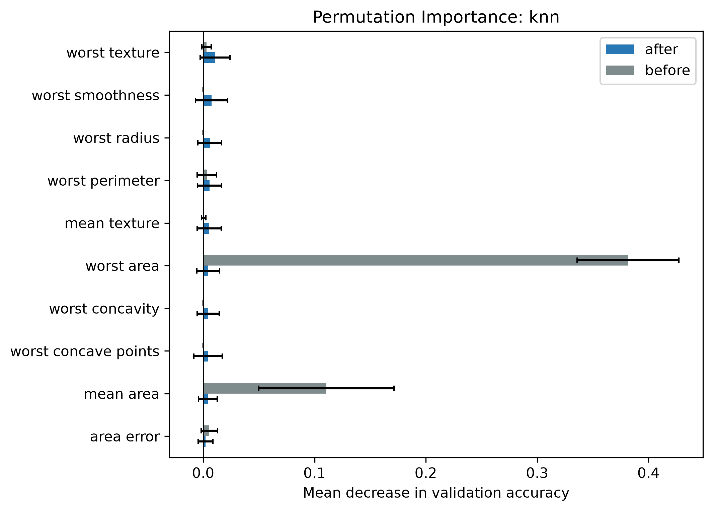
*図 A.1: k-NNモデルにおけるPermutation Importance*

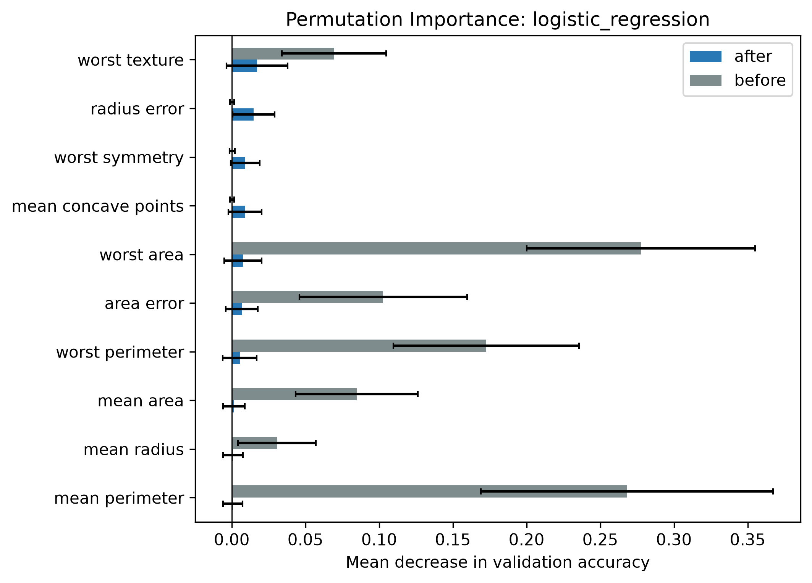
*図 A.2: ロジスティック回帰モデルにおけるPermutation Importance*

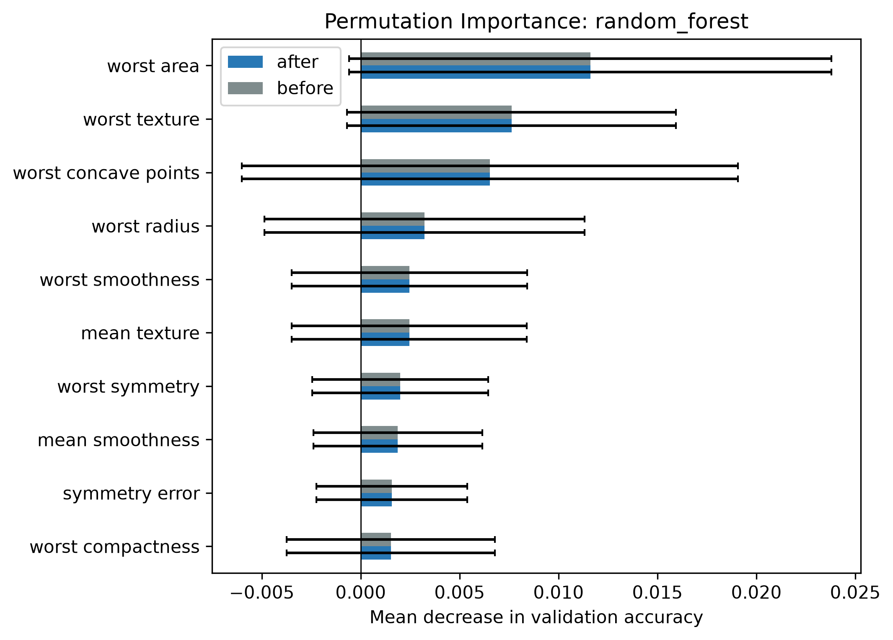
*図 A.3: ランダムフォレストモデルにおけるPermutation Importance*

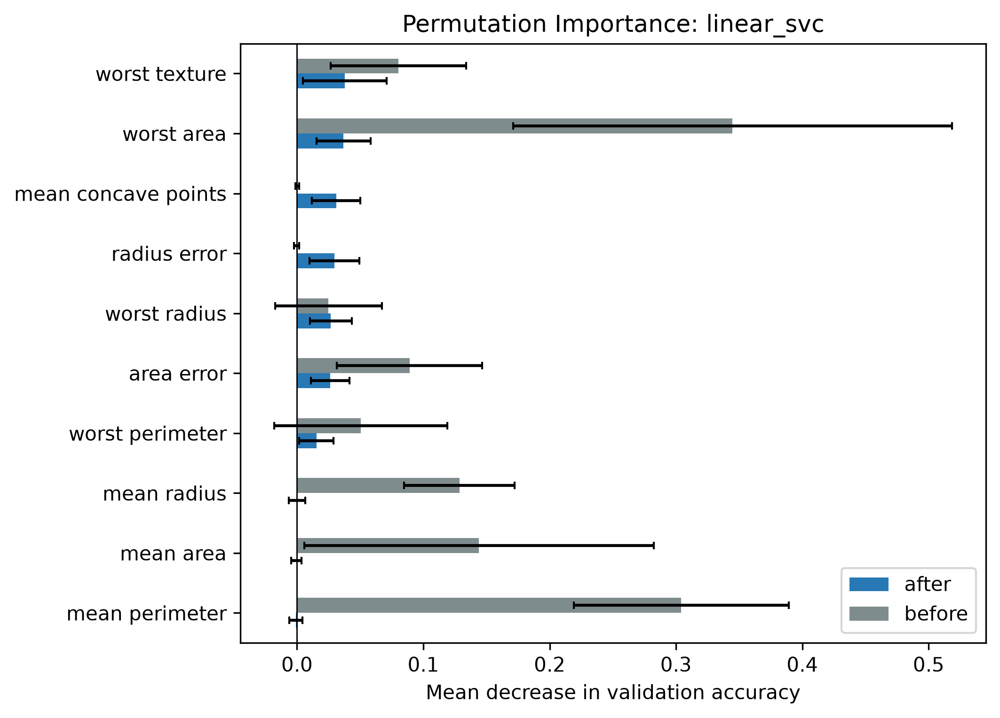
*図 A.4: サポートベクターマシン (SVC) におけるPermutation Importance*

</div>

#### 解釈上の注意

Permutation Importanceは未使用の検証Fold上で算出したため、係数の絶対値やRandom Forestの不純度ベース重要度よりモデル間比較に適する。一方、本データには相関の強い特徴量が複数あり、代替可能な特徴量を一つだけ並べ替えても予測性能が大きく低下しない場合がある。このため、値を各特徴量の独立した因果的寄与とは解釈しない。小さな負値は、有限標本と並べ替えによる変動の範囲で生じ得る。

未標準化Logistic Regressionは5 Foldすべてで `max_iter=2000` に達する収束警告が発生した。その条件の重要度は未収束モデルに基づく記述値であり、Afterとの差に標準化だけでなく最適化の収束状態も反映され得る。既存の実験条件を維持するため、発展実験のみで反復回数やソルバーは変更していない。

#### 実務的示唆

- スケール依存モデルでは標準化と収束状況を説明性評価より先に品質ゲートとして確認する。
- モデル間の判断感度比較には、生係数の絶対値より検証データでの Permutation Importance を優先する。
- 相関特徴量の重要度を独立した因果寄与や削除根拠として扱わず、特徴量群としての冗長性を確認する。

#### 再現性

- 実行日時: 2026-07-30T10:30:03+07:00
- Python: 3.14.4
- scikit-learn: 1.9.0
- OS: Linux-7.0.0-28-generic-x86_64-with-glibc2.43
- scoring: `accuracy` / repeats: 30 / seed: 42

### 実験B (発展) ：推論時欠損と予測可能率

#### 目的とデータ

自然欠損を含むOpenML Titanic v1 (data_id=40945、1,309件) を用い、推論要求に欠損が含まれる場合の行削除と補完を比較した。使用特徴量は `pclass`, `sex`, `age`, `sibsp`, `parch`, `fare`, `embarked` である。結果発生後に判明する `boat`・`body`、識別性の高い `name`・`ticket`、欠損率の高い `cabin`・`home.dest` は除外した。

#### 評価方法

- 本文と同じ5分割StratifiedKFold (shuffle=True, random_state=42) を全条件・全モデルで共用した。
- Before (行削除) : 学習時は欠損行を除外し、推論時は7特徴量がすべて揃う行だけを予測した。欠損行は予測不能 (abstain) として数えた。
- After (補完) : 数値を学習Foldの中央値、カテゴリを学習Foldの最頻値で補完し、全推論行を予測した。補完器はPipeline内でFoldごとにfitした。
- `accuracy_predicted`は実際に予測できた行だけの性能、`correct_fraction_all`は正解予測数を全推論要求数で割った運用指標であり、予測不能を不正解相当として扱う。

#### 結果

Coverage は Before (平均 0.797 / 未予測率 0.203) から、After では全条件で 1.000 (100%) に到達した。

| モデル | Before: 予測行Accuracy | Before: 全要求中の正解割合 | After: 全行Accuracy | After: 欠損行Accuracy | 差 (After−Before全要求)  |
|:--|--:|--:|--:|--:|--:|
| logistic_regression | 0.785 | 0.626 | 0.788 | 0.793 | +0.162 |
| linear_svc | 0.780 | 0.621 | 0.787 | 0.799 | +0.166 |
| random_forest | 0.788 | 0.628 | 0.798 | 0.799 | +0.170 |
| knn | 0.789 | 0.629 | 0.807 | 0.825 | +0.179 |

<div class="figure-grid-2col" markdown="1">

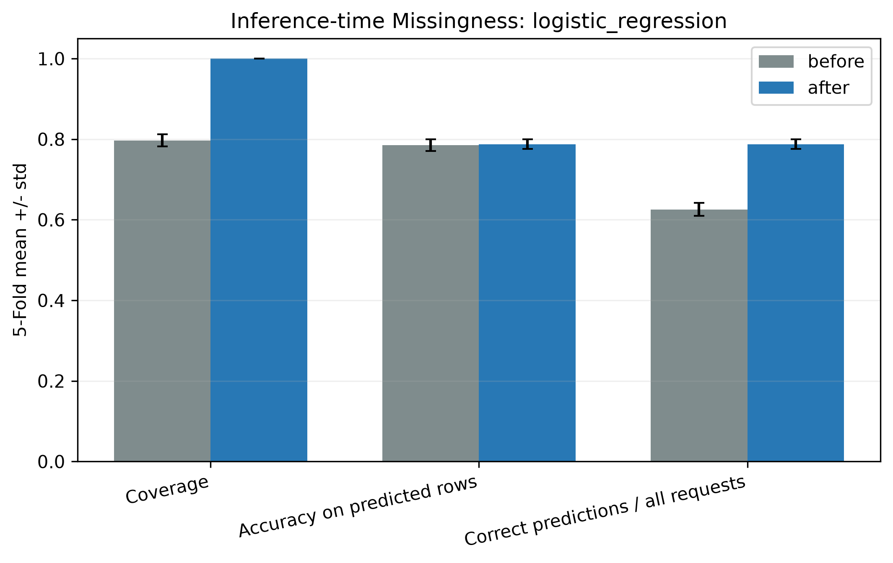
*図 B.1: Logistic Regressionの推論時欠損とCoverage*


*図 B.2: Linear SVCの推論時欠損とCoverage*

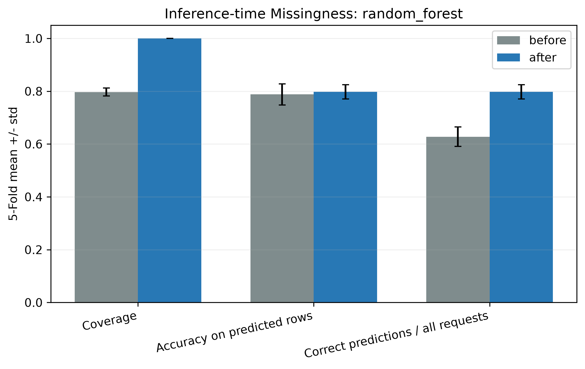
*図 B.3: Random Forestの推論時欠損とCoverage*

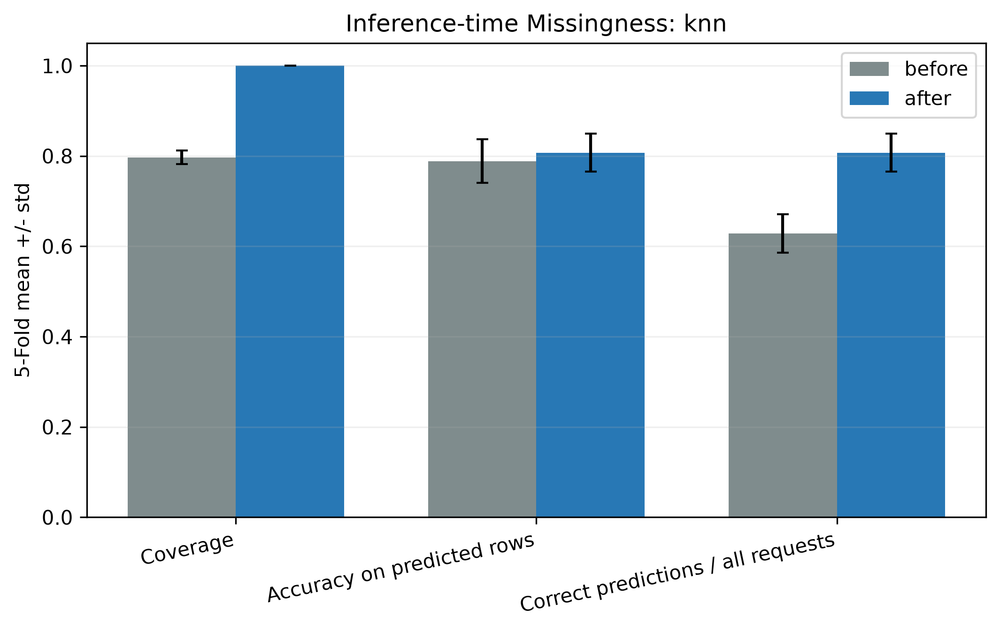
*図 B.4: k-NNの推論時欠損とCoverage*

</div>

#### 解釈

Before（完全行限定）とAfter（全行対象）は評価範囲が異なり単純比較できないため、運用時はCoverageと全体の正解率を併記すべきである。AfterのCoverage 100%は出力の強制を意味し、欠損行の予測精度を保証しない。詳細は行タイプ別CSVを参照。欠損は自然発生しておりMCARとは限らない。またTitanicは歴史的な小規模データであるため、結果はCoverage指標の挙動確認であり、現行業務への性能一般化を目的としない。

#### 実務的示唆

- AccuracyとともにCoverage、予測不可率、全要求中の正解割合をサービス指標として管理する。
- 欠損行を一律削除せず、予測不能が特定属性や入力チャネルへ集中していないか監査する。
- Coverage 100%を品質保証とみなさず、欠損パターン別性能や信頼度に応じた保留・人手確認も設計する。

#### 再現性

- Source: https://www.openml.org/d/40945
- 実行日時: 2026-07-30T10:27:52+07:00
- Python: 3.14.4
- scikit-learn: 1.9.0
- OS: Linux-7.0.0-28-generic-x86_64-with-glibc2.43
- seed: 42

### 実験C (発展) ：内側CVによる閾値最適化

#### 目的と設計

不均衡二値分類において、判定閾値を外側testで調整する評価リークを避けながら、F1最大化閾値の効果を評価した。既存実験Cと同じ2,000件・正例約7%の合成データ、補正なしC0条件、外側5-Foldを使用した。閾値効果をSMOTEやクラス重みの効果と混在させないため、対象はLogistic RegressionとLinear SVCに限定した。

各外側train内で3-Fold OOF確率を生成し、0.05〜0.95 (0.01刻み) からF1が最大となる閾値を選択した。同値の場合は0.5に近い値を採用した。選択後、外側train全体でモデルを再fitし、未使用の外側testで一度だけ評価した。Linear SVCは`CalibratedClassifierCV(method='sigmoid', cv=3)`を各学習範囲内で使用した。

#### 結果

| モデル | 選択閾値 mean ± std | F1: 0.5 | F1: tuned | ΔF1 | Precision: 0.5→tuned | Recall: 0.5→tuned |
|:--|--:|--:|--:|--:|--:|--:|
| logistic_regression | 0.316 ± 0.038 | 0.524 | 0.575 | +0.050 | 0.819→0.642 | 0.392→0.528 |
| linear_svc | 0.298 ± 0.029 | 0.527 | 0.584 | +0.057 | 0.860→0.638 | 0.385→0.541 |

Fold単位のF1改善数は、ロジスティック回帰が5/5 Fold、Linear SVCが4/5 Fold（1 Fold悪化）であった。

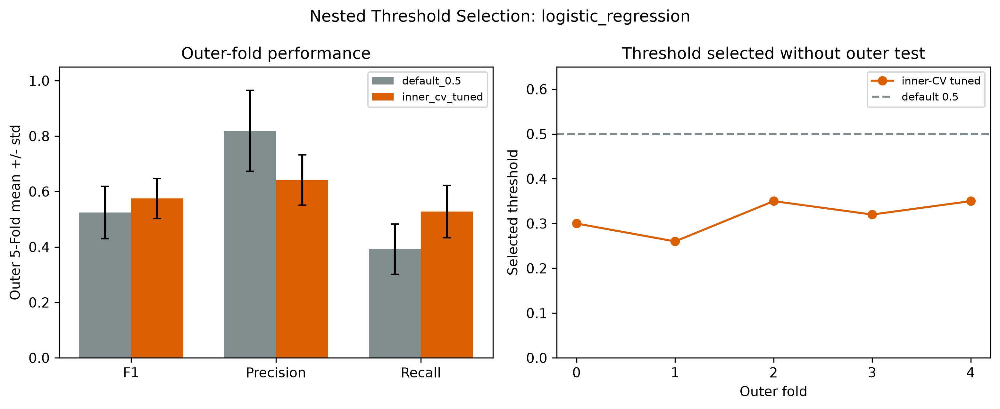
*図 C.1: Logistic Regressionの内側CV閾値選択と外側Fold性能*


*図 C.2: 校正済みLinear SVCの内側CV閾値選択と外側Fold性能*

#### 解釈上の注意

最適化対象をF1に事前固定したため、閾値低下によってRecallが上がる一方、Precisionが下がる可能性がある。Average PrecisionとROC-AUCは確率ランキングに依存する閾値非依存指標であり、同一外側Fold・同一モデルではdefault/tuned間で変化しない。

選択閾値と外側性能にはFold間変動がある。ここで得た閾値を普遍的な固定値とは解釈せず、運用時のクラス比率・誤検知/見逃しコスト・確率校正の変化に応じて学習データ内だけで再選択する必要がある。外側Foldは閾値選択にも校正にも使用していない。

#### 実務的示唆

- 閾値最適化の目的関数を事前固定し、外側testや本番結果で後から選び直さない。
- Linear SVCのスコアを確率として使う場合、学習範囲内だけで校正する。
- Average Precision等のランキング評価と、Recall・Precision・F1等の閾値依存指標は分けて監視する。

#### 再現性

- 実行日時: 2026-07-30T11:00:08+07:00
- Python: 3.14.4
- scikit-learn: 1.9.0
- OS: Linux-7.0.0-28-generic-x86_64-with-glibc2.43
- outer folds: 5 / inner folds: 3 / seed: 42
- condition: C0 (補正なし)  / threshold objective: F1

### 実験D (発展) ：D0〜D3アブレーション

#### 設計

| 条件 | クレンジング | 形態素解析 |
|:--|:--|:--|
| D0 | なし | MeCab＋IPAdic |
| D1 | neologdn | MeCab＋IPAdic |
| D2 | なし | Sudachi core＋Mode C |
| D3 | neologdn | Sudachi core＋Mode C |

livedoor News Corpusの重複除去後7,361記事を使用した。既存実験Dと同じ外側5-Fold、TF-IDF設定、4モデル、乱数seedを全条件で共用し、TF-IDFは各学習Fold内だけでfitした。クレンジングと解析器以外の条件を固定し、同一Foldのペア差として要因効果を算出した。

#### macro-F1

| モデル | D0 | D1 | D2 | D3 |
|:--|--:|--:|--:|--:|
| logistic_regression | 0.9118 ± 0.0035 | 0.9087 ± 0.0016 | 0.9120 ± 0.0047 | 0.9094 ± 0.0055 |
| linear_svc | 0.9413 ± 0.0058 | 0.9414 ± 0.0062 | 0.9400 ± 0.0068 | 0.9393 ± 0.0066 |
| random_forest | 0.8895 ± 0.0071 | 0.8859 ± 0.0064 | 0.8883 ± 0.0065 | 0.8850 ± 0.0128 |
| knn | 0.7917 ± 0.0058 | 0.7839 ± 0.0074 | 0.7920 ± 0.0034 | 0.7891 ± 0.0048 |

#### 語彙数・決定論的前処理コスト

| 条件 | 語彙数 | クレンジング秒 | 解析秒 | 合計秒 |
|:--|--:|--:|--:|--:|
| D0 | 42,123 | 0.000 | 5.937 | 5.937 |
| D1 | 42,123 | 4.346 | 5.879 | 10.225 |
| D2 | 47,222 | 0.000 | 12.794 | 12.794 |
| D3 | 46,936 | 4.346 | 12.099 | 16.445 |

#### 要因別macro-F1差

| モデル | Cleaning: simple D1−D0 | Cleaning: advanced D3−D2 | Analyzer: raw D2−D0 | Analyzer: cleaned D3−D1 |
|:--|--:|--:|--:|--:|
| logistic_regression | -0.0031 | -0.0026 | +0.0002 | +0.0007 |
| linear_svc | +0.0001 | -0.0007 | -0.0013 | -0.0022 |
| random_forest | -0.0037 | -0.0033 | -0.0012 | -0.0009 |
| knn | -0.0078 | -0.0028 | +0.0002 | +0.0052 |

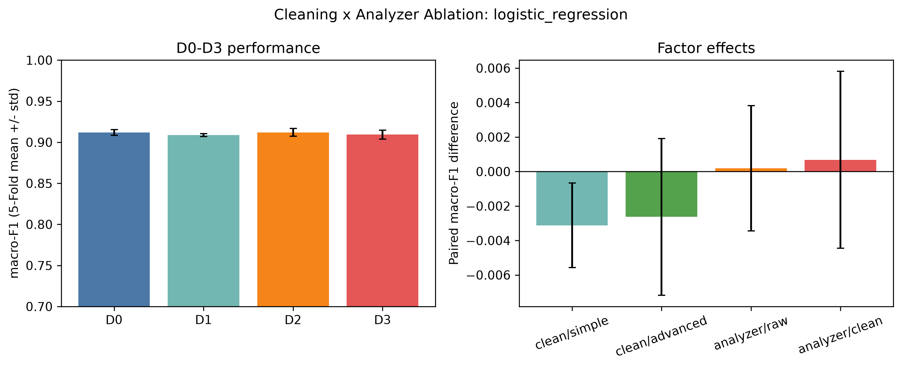
*図 D.1: Logistic Regressionの性能と要因効果*

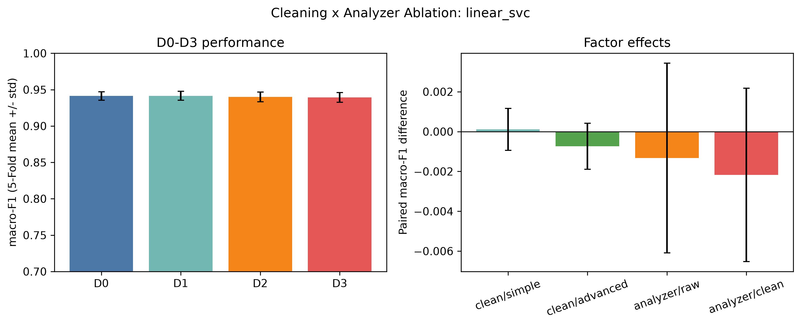
*図 D.2: Linear SVCの性能と要因効果*

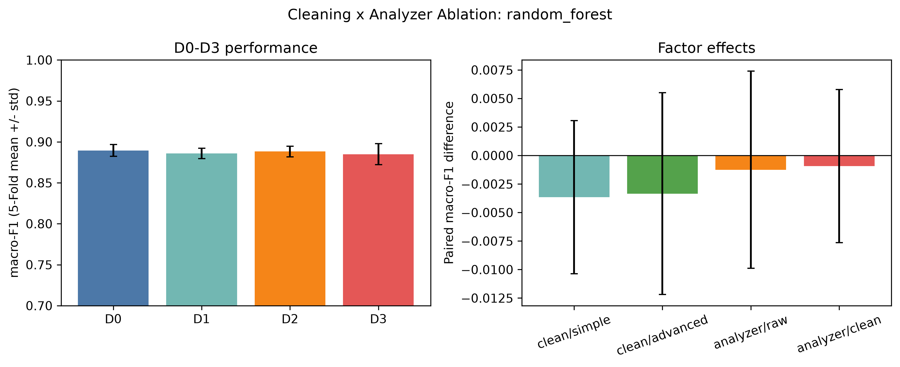
*図 D.3: Random Forestの性能と要因効果*

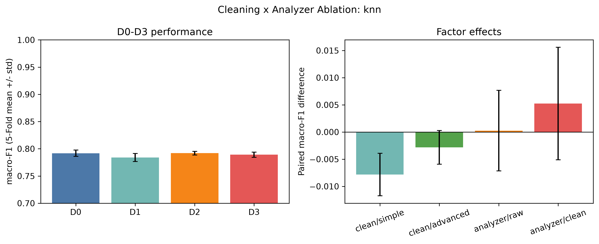
*図 D.4: k-NNの性能と要因効果*

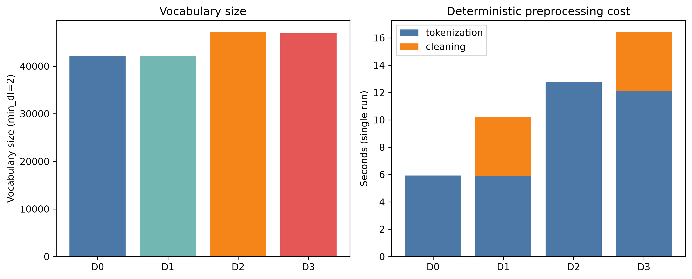
*図 D.5: D0〜D3の語彙数と決定論的前処理コスト*

#### 結果の要約

クレンジング効果は、MeCab/IPAdic条件ではLinear SVC (+0.0001) を除く3モデルでmacro-F1が低下し、Sudachi条件では4モデルすべてで低下した。最大低下はMeCab/IPAdic＋k-NNの−0.0078だった。解析器効果は−0.0022〜+0.0052の範囲でモデル・クレンジング条件により方向が異なり、一貫した改善は観測されなかった。

MeCab/IPAdicではneologdn適用前後の語彙数がともに42,123だった。Sudachiでは47,222から46,936へ286語 (0.61%) 減少したが、MeCab/IPAdicより約4,800語多かった。単一実行の合計前処理時間はD0 5.94秒、D1 10.23秒、D2 12.79秒、D3 16.44秒であり、本データ・実装では高度解析とクレンジングはいずれも処理コストを増加させた。

#### 実務的示唆

- クレンジングと解析器を同時変更せず、アブレーションで各処理の増分価値を確認する。
- 精度差がFold変動より小さい場合、処理時間、辞書保守、障害点の増加も含めて採否を決める。
- 語彙数の削減自体を目的化せず、未知語・固有表現・クラス別性能への影響を確認する。

#### 解釈上の注意

2×2比較により、クレンジング効果は同じ解析器内 (D1−D0、D3−D2) 、解析器効果は同じクレンジング条件内 (D2−D0、D3−D1) で評価した。差は同一外側Foldの記述的ペア差であり、CV Foldを独立標本とみなす有意差検定は行っていない。

語彙数は全データに記述統計としてTF-IDF (min_df=2、max_features制限なし) をfitした値で、性能評価には使用していない。前処理時間は単一実行の参考値であり、クレンジング済みテキストをD1/D3で共用して計算した実測時間を、それぞれのEnd-to-End想定コストへ加算した。CPU負荷等による変動を含む。

#### 再現性

- 実行日時: 2026-07-30T11:20:42+07:00
- Python: 3.14.4
- scikit-learn: 1.9.0
- OS: Linux-7.0.0-28-generic-x86_64-with-glibc2.43
- outer folds: 5 / seed: 42
