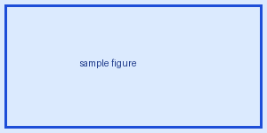

# レイアウト検証用サンプル文書

## 第1章：サンプル

### 1.1 図とキャプション

以下はテスト用の図である。


*図 1.1: レイアウト検証用のサンプル図*

### 1.2 短い表

| 短い表の列見出しA | 短い表の列見出しB |
| :-- | :-- |
| 先頭行データあいうえお | 先頭行データかきくけこ |
| 末尾行データさしすせそ | 末尾行データたちつてと |

### 1.3 長い表

| 列A | 列B |
| :-- | :-- |
| 1 | a |
| 2 | b |
| 3 | c |
| 4 | d |
| 5 | e |
| 6 | f |
| 7 | g |
| 8 | h |
| 9 | i |
| 10 | j |
| 11 | k |
| 12 | l |
| 13 | m |
| 14 | n |
| 15 | o |
| 16 | p |
| 17 | q |
| 18 | r |

### 1.4 短いコード

```python
first_value = 1
second_value = 2
print(first_value + second_value)
```

### 1.5 長いコード

```python
line_00 = 0
line_01 = 1
line_02 = 2
line_03 = 3
line_04 = 4
line_05 = 5
line_06 = 6
line_07 = 7
line_08 = 8
line_09 = 9
line_10 = 10
line_11 = 11
line_12 = 12
line_13 = 13
line_14 = 14
line_15 = 15
line_16 = 16
line_17 = 17
line_18 = 18
line_19 = 19
line_20 = 20
line_21 = 21
line_22 = 22
line_23 = 23
line_24 = 24
line_25 = 25
line_26 = 26
line_27 = 27
line_28 = 28
line_29 = 29
line_30 = 30
line_31 = 31
line_32 = 32
line_33 = 33
line_34 = 34
```

## 第2章：末尾見出し

### 2.1 末尾の小見出し
